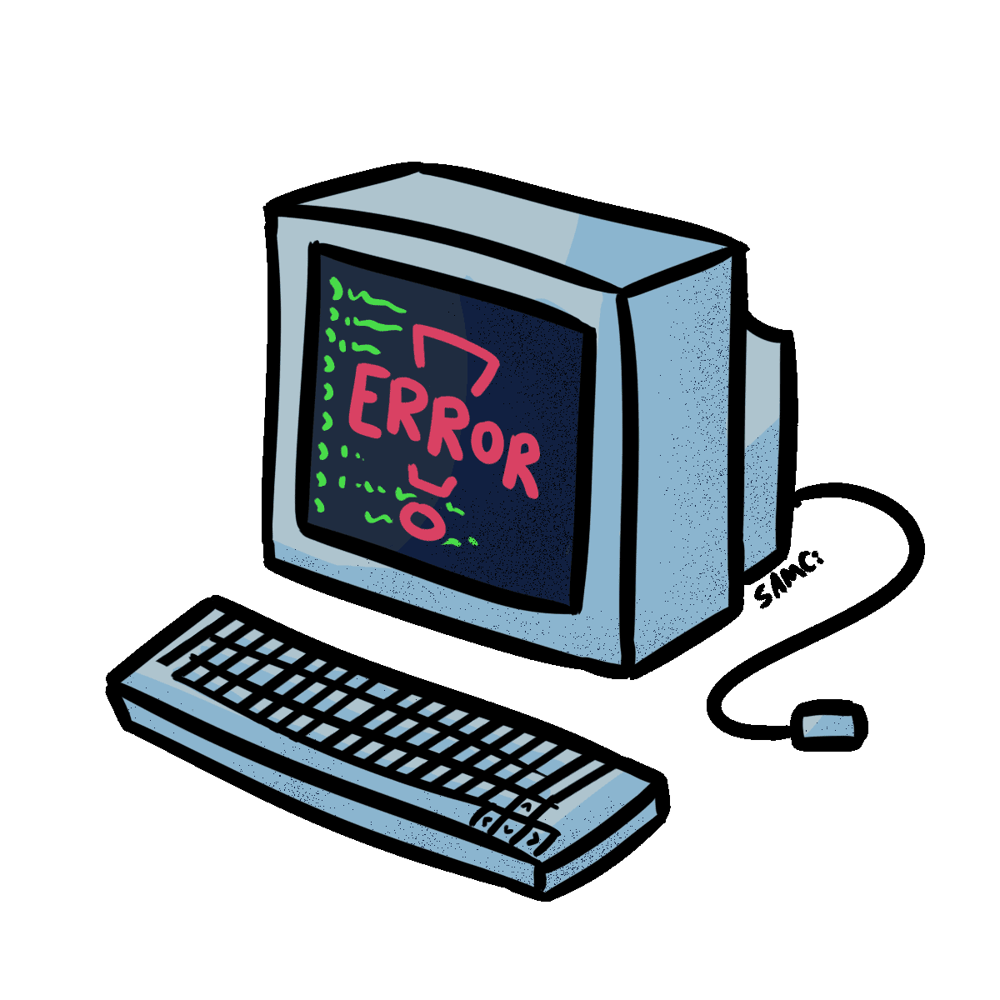

<h1 align="left">👋 Hi there! I'm Andrei Cristian</h1>

🎓 Third-year student at the  
Faculty of Mathematics and Computer Science,  
University of Bucharest

<h2 align="left">🧑‍💻 About Me</h2>

- 🌱 I’m currently working on **various personal and
   
  collaborative projects to enhance my skills**
   
- 📟 Exploring **Low-Level Programming**
   
- 🔐 Interested in **Cybersecurity** topics such as:
   
  **Reverse Engineering, Binary Exploitation, Cryptography**
   

<h2 align="left">🔧 Technologies & Tools</h2>

 
  
  
  
  
  
  
  

   
  
  
   
  
  
  

<h2 align="left">📊 GitHub Stats</h2>

  

