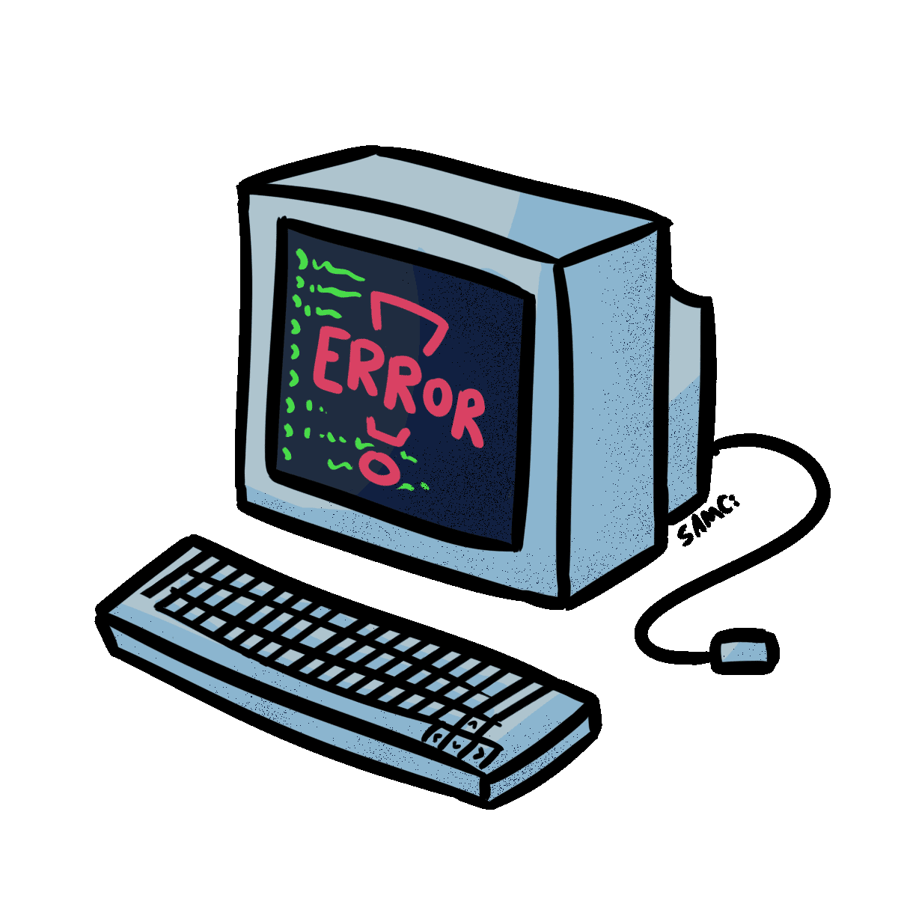

 

<h3>👋 Hi there! I'm Andrei Cristian</h3>

  🎓 Third-year student at the  
  Faculty of Mathematics and Computer Science,  
  University of Bucharest

<h3>🧑‍💻 About Me</h3>

- 🛡️ Deeply passionate about **Cybersecurity**: Forensics, Pentesting, Binary Exploitation, Cryptography, Reverse Engineering
- 🧠 Dedicated to **Machine Learning** and **Data Science**
- 📟 Exploring the intricacies of **Low-Level Programming**

<h3>🔧 Technologies & Tools</h3>

  
  
  
  
  
  
   
  
   
  
  
  
  
   
   
  
  
  
  
  

<h3>📊 Stats</h3>

  
  &nbsp;&nbsp;
 
  

